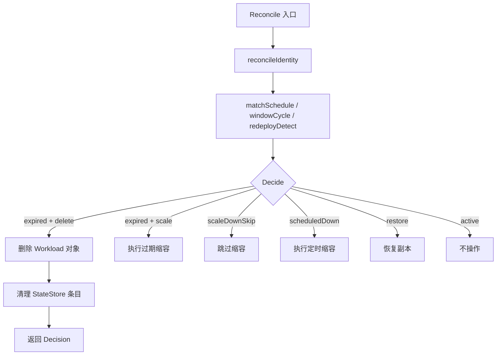

# Design Document: Expired Workload Deletion

## Overview

本设计为 kube-workload-lifecycle-manager 增加"过期 Workload 删除"能力。当策略显式配置 `expiredAction: delete` 时，Revision 超过 maxAge 的 Workload 将被直接删除（Deployment 或 StatefulSet 对象本身），而非缩容到 expired 目标值。

设计原则：
- **Opt-in 安全**：仅在策略显式配置时执行删除，默认行为不变
- **最小侵入**：在现有决策引擎中新增一个 Decision 标志，不改变优先级骨架
- **先删后清**：确保 Workload 删除成功后再清理状态，避免不一致
- **权限最小化**：仅新增 `delete` 动词，不扩展其他权限

## Architecture



变化集中在：
1. `policy` 包：新增 `ExpiredAction` 字段和校验
2. `lifecycle.Decide()`：新增 `ExpiredAction` 输入，返回 `DeleteWorkload` 标志
3. `workload` 包：新增 `WorkloadDeleter` 接口
4. `controller/transition.go`：Decision 含 `DeleteWorkload=true` 时调用删除并清理状态
5. `config/base/cluster-role.yaml`：新增 `delete` 动词

## Components and Interfaces

### 1. Policy Layer

#### `internal/policy/raw.go`

```go
type rawLifecycle struct {
    MaxAge        *string      `yaml:"maxAge,omitempty"`
    Revision      *rawRevision `yaml:"revision,omitempty"`
    ExpiredAction *string      `yaml:"expiredAction,omitempty"` // 新增
}
```

#### `internal/policy/types.go`

```go
const (
    ExpiredActionScale  = "scale"
    ExpiredActionDelete = "delete"
)

type Lifecycle struct {
    MaxAge        time.Duration
    Revision      lifecycle.TrackingSpec
    ExpiredAction string // "scale" (default) | "delete"
}
```

#### `internal/policy/validate.go`（编译逻辑）

```go
func compileLifecycle(raw *rawLifecycle) (Lifecycle, error) {
    // ... 现有 maxAge/revision 编译 ...

    expiredAction := ExpiredActionScale
    if raw.ExpiredAction != nil && *raw.ExpiredAction != "" {
        switch *raw.ExpiredAction {
        case ExpiredActionScale, ExpiredActionDelete:
            expiredAction = *raw.ExpiredAction
        default:
            return Lifecycle{}, fmt.Errorf("invalid expiredAction %q: must be %q or %q",
                *raw.ExpiredAction, ExpiredActionScale, ExpiredActionDelete)
        }
    }

    return Lifecycle{MaxAge: maxAge, Revision: revision, ExpiredAction: expiredAction}, nil
}
```

### 2. Decision Engine (`internal/lifecycle/decision.go`)

#### 新增常量和输入字段

```go
const ReasonRevisionExpiredDeleted = "revision-lifecycle-expired:deleted"

type DecisionInput struct {
    // ... 现有字段 ...
    ExpiredAction string // "scale" | "delete"
}

type Decision struct {
    DesiredReplicas         int32
    Reason                  string
    NeedsSnapshot           bool
    ShouldScale             bool
    ClearSnapshotAfterScale bool
    DeleteWorkload          bool // 新增
}
```

#### `Decide()` 变更

```go
func Decide(input DecisionInput) Decision {
    // 1. Revision 过期 — 最高优先级
    if !input.Now.Before(input.FirstSeenAt.Add(input.MaxAge)) {
        if input.ExpiredAction == "delete" {
            return Decision{
                DesiredReplicas: input.CurrentReplicas,
                Reason:          ReasonRevisionExpiredDeleted,
                DeleteWorkload:  true,
            }
        }
        return downDecision(input, input.ExpiredTarget, ReasonRevisionExpired)
    }

    // 2-5. 现有逻辑不变 ...
}
```

### 3. Workload Deleter (`internal/workload`)

新增接口（不修改现有 `ScaleGateway`）：

```go
// WorkloadDeleter deletes a Deployment or StatefulSet object.
type WorkloadDeleter interface {
    Delete(ctx context.Context, w Workload) error
}
```

实现通过 Kubernetes `appsv1` client 的 `DeleteDeployment` / `DeleteStatefulSet` 完成，使用 `Foreground` 删除策略（让 GC 处理级联 Pod 清理）。

### 4. Transition Reconciler (`internal/controller/transition.go`)

#### Reconciler 结构新增

```go
type Reconciler struct {
    store   state.StateStore
    scale   workload.ScaleGateway
    deleter workload.WorkloadDeleter // 新增
    hpa     HPAEvaluator
    clock   lifecycle.Clock
}
```

#### `Reconcile()` 变更

在 `Decide()` 调用时传入 `ExpiredAction`：

```go
decision := lifecycle.Decide(lifecycle.DecisionInput{
    // ... 现有字段 ...
    ExpiredAction: selected.Lifecycle.ExpiredAction,
})
```

在 `applyDecision` 之前新增删除分支：

```go
if decision.DeleteWorkload {
    if err := r.deleter.Delete(ctx, live); err != nil {
        return decision, fmt.Errorf("delete expired workload %s: %w", current.Key(), err)
    }
    // 删除成功，清理状态
    delete(document.States, current.Key())
    if err := r.store.Save(ctx, document); err != nil {
        // 对象已删除但状态清理失败，记录错误；下次调谐不会再看到该 Workload
        // （因为 Watch 不会再上报已删除对象），状态条目最终由 GC 或手动清理
        return decision, fmt.Errorf("clean state after deleting %s: %w", current.Key(), err)
    }
    return decision, nil
}
```

### 5. RBAC (`config/base/cluster-role.yaml`)

```yaml
rules:
  - apiGroups: ["apps"]
    resources: ["deployments", "statefulsets"]
    verbs: ["get", "list", "watch", "delete"]  # 新增 delete
  - apiGroups: ["apps"]
    resources: ["deployments/scale", "statefulsets/scale"]
    verbs: ["get", "update"]
  - apiGroups: ["autoscaling"]
    resources: ["horizontalpodautoscalers"]
    verbs: ["get", "list", "watch"]
```

## Data Models

### Policy YAML 配置示例

```yaml
policies:
  - name: pfb-workload
    priority: 50
    target:
      kinds: [Deployment, StatefulSet]
      namePatterns:
        - ".*pfb\\d+"
    lifecycle:
      maxAge: 48h
      expiredAction: delete  # 新增
      revision:
        source: ContainerImages
    replicas:
      scheduledDown: 0
      expired: 0  # 当 expiredAction=delete 时此值不使用
```

### Decision 完整结构

```go
type Decision struct {
    DesiredReplicas         int32
    Reason                  string
    NeedsSnapshot           bool
    ShouldScale             bool
    ClearSnapshotAfterScale bool
    DeleteWorkload          bool   // true 时执行删除，忽略 scale 相关字段
}
```

### 决策优先级表（更新后）

| 优先级 | 条件 | Reason | 行为 |
|--------|------|--------|------|
| 1a | age >= maxAge, expiredAction=delete | `revision-lifecycle-expired:deleted` | 删除 Workload |
| 1b | age >= maxAge, expiredAction=scale | `revision-lifecycle-expired` | 缩容到 expiredTarget |
| 2 | ScaleDownSkipped && ScheduledDown | `scale-down-skipped:*` | 不操作 |
| 3 | ScheduledDown | `scale-down-window:{name}` | 缩容到 scheduledTarget |
| 4 | SnapshotReplicas != nil | `restore-previous-replicas` | 恢复到快照值 |
| 5 | 其他 | `active-window` | 不操作 |

## Correctness Properties

### Property 1: Opt-in Safety

*For any* 策略未配置 `expiredAction` 或配置为 `scale`，即使 Revision 已过期，Controller 绝不执行删除操作。

**Validates: Requirements 1.2, 7.1**

### Property 2: Delete Precedes Scale on Expiry

*For any* 过期 Workload 匹配 `expiredAction: delete` 策略，Decide 返回 `DeleteWorkload=true` 且 `NeedsSnapshot=false`、`ShouldScale=false`。

**Validates: Requirements 2.1, 3.1**

### Property 3: Delete-then-Clean Ordering

*For any* 成功删除的 Workload，状态条目在同一调谐周期内从 StateStore 移除。删除 API 失败时状态不变。

**Validates: Requirements 4.1, 4.3, 4.4**

### Property 4: Snapshot Bypass

*For any* 过期且 `expiredAction: delete` 的 Workload，Controller 不执行 snapshot 捕获、不执行 scale 写入、不尝试 snapshot 恢复。

**Validates: Requirements 3.1, 3.2**

### Property 5: Non-expired Normal Behavior

*For any* 未过期的 Workload，即使策略配置了 `expiredAction: delete`，Controller 仍执行正常的窗口缩容/恢复逻辑。

**Validates: Requirements 3.3**

### Property 6: Invalid Action Rejection

*For any* PolicySet 包含无效 `expiredAction` 值，整个 PolicySet 被拒绝，Controller 保留上一次有效快照。

**Validates: Requirements 1.3**

### Property 7: Expired Priority Unchanged

*For any* 同时满足过期和 ScaleDownSkipped 的 Workload，过期决策（无论 scale 或 delete）始终优先。

**Validates: Requirements 6.1**

## Error Handling

### 删除 API 失败

- 返回错误，Reconcile 整体失败
- 不修改 StateStore
- 下次调谐重试：Revision 仍过期，策略仍为 delete，会再次尝试

### 状态清理失败

- Workload 已被删除（Kubernetes 中不存在）
- StateStore Save 失败，状态条目残留
- 下次调谐：Workload 不在 inventory 中（Watch 不会上报已删除对象）
- 残留状态不会被再次访问，不影响功能
- 可通过状态 GC 机制或手动清理

### 策略加载失败

- 与现有行为一致：原子拒绝，保留上次有效 PolicySet
- `expiredAction` 字段解析失败等同于无效策略
- Controller 不执行删除，安全回退

### 权限不足

- 如果 ClusterRole 未更新（缺少 `delete` 权限）
- 删除 API 返回 403 Forbidden
- Controller 记录错误，下次重试（直到 RBAC 修复）

## Testing Strategy

### 单元测试

| 场景 | 测试重点 |
|------|---------|
| Decide: expiredAction=delete + expired → DeleteWorkload=true | 决策正确性 |
| Decide: expiredAction=scale + expired → 现有 downDecision | 向后兼容 |
| Decide: expiredAction=delete + not expired → 正常逻辑 | 非过期不删除 |
| Decide: expired + delete 优先于 ScaleDownSkipped | 优先级 |
| compileLifecycle: 有效值 scale/delete 通过 | 校验 |
| compileLifecycle: 无效值 "remove" 拒绝 | 校验 |
| compileLifecycle: 空/nil 默认 scale | 默认值 |

### Controller 集成测试

| 场景 | 验证内容 |
|------|---------|
| 过期 + delete → 调用 deleter.Delete + 状态清理 | 端到端 |
| 过期 + delete + Delete 失败 → 状态不变 | 错误路径 |
| 过期 + delete + Delete 成功 + Save 失败 → 对象已删除 | 部分失败 |
| 未过期 + delete → 正常缩容 | 非过期行为 |
| 过期 + scale → 不调用 Delete | 默认行为 |

### RBAC 验证

- `make manifests` 生成的 deploy.yaml 包含 `delete` 动词
- 集成测试中 fake deleter 验证调用顺序

### 向后兼容

- 所有现有测试不修改断言仍通过
- 不配置 `expiredAction` 的策略行为完全不变
