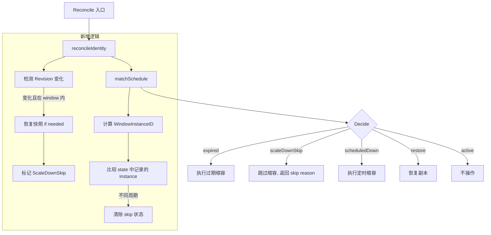
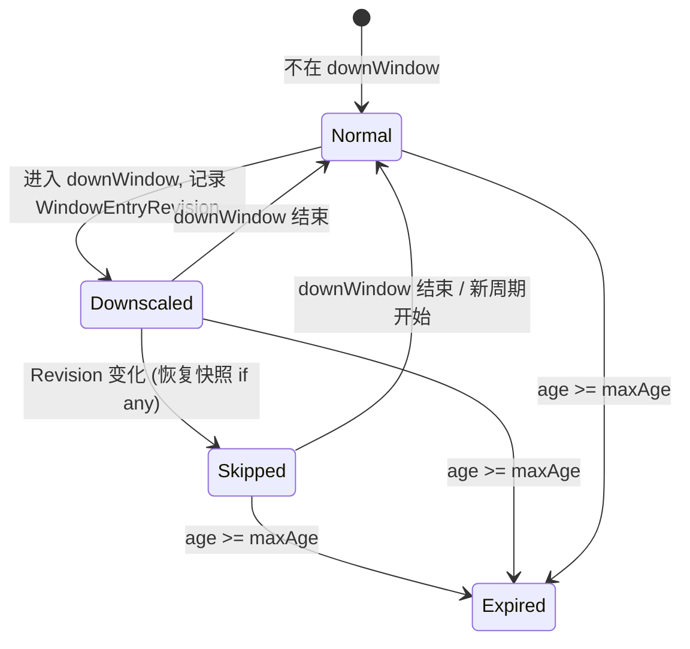

# Design Document: Skip Scale-Down on Redeploy

## Overview

本设计为 kube-workload-lifecycle-manager 增加"窗口内重新发布跳过缩容"能力。核心思路：在 downWindow 期间，如果 Workload 的 Revision（容器镜像 hash）发生变化，Controller 将跳过后续定时缩容，允许新版本正常运行直到当前窗口周期结束。

该功能解决的核心痛点：开发团队在夜间/周末维护窗口内发布新版本后，Controller 仍按定时策略缩容新版本，导致新部署无法正常验证和服务。

设计原则：
- **最小侵入**：仅在决策引擎中新增一个分支，不改变现有 expired/scheduled/restore/active 的逻辑骨架
- **状态驱动**：所有跳过判断基于持久化状态字段，Controller 重启后行为一致
- **窗口隔离**：不同窗口周期互相独立，避免跨周期误判

## Architecture



整体数据流保持不变。变化集中在：
1. `state.WorkloadState` 新增三个字段
2. `lifecycle.Decide()` 新增 ScaleDownSkip 分支（优先级介于 expired 和 scheduledDown 之间）
3. `controller.Reconciler.Reconcile()` 中 `reconcileIdentity` 后新增窗口内 revision 变化检测逻辑

## Components and Interfaces

### 1. State Layer (`internal/state/types.go`)

新增字段到 `WorkloadState`：

```go
type WorkloadState struct {
    // ... 现有字段 ...

    // WindowEntryRevision 记录进入 downWindow 时（首次缩容时）的 RevisionHash。
    // 仅在 downWindow 内有值，窗口外清空。
    WindowEntryRevision string `json:"windowEntryRevision,omitempty"`

    // WindowInstanceID 标识当前 downWindow 的具体周期实例。
    // 格式: "{windowName}:{YYYY-MM-DD}" 其中日期为窗口开始日。
    // 用于区分同名窗口的不同周期（如每日夜间窗口的周一实例和周二实例）。
    WindowInstanceID string `json:"windowInstanceID,omitempty"`

    // ScaleDownSkipped 标记该 Workload 在当前窗口周期内因 Revision 变化而跳过缩容。
    // 仅在 WindowInstanceID 对应的周期内有效。
    ScaleDownSkipped bool `json:"scaleDownSkipped,omitempty"`
}
```

### 2. Window Instance ID 计算 (`internal/schedule/instance.go`)

新增函数用于计算窗口周期的唯一标识：

```go
// WindowInstanceID 生成当前窗口周期的唯一标识符。
// 格式: "{windowName}:{startDate}" 其中 startDate 是窗口在该周期内的
// 实际开始日期 (YYYY-MM-DD 格式，基于窗口配置的时区)。
func WindowInstanceID(now time.Time, timezone string, windowName string, window Window) (string, error)
```

计算逻辑：
- 对于 `allDay` 窗口：直接使用当前日期（在配置时区中）
- 对于有时间范围的窗口：
  - 如果 `start < end`（不跨天）：使用当前日期
  - 如果 `start >= end`（跨天）：如果当前时间 < end，使用前一天日期；否则使用当前日期

这样确保同一个窗口实例（即使跨越午夜）总是产生相同的 ID。

### 3. Decision Engine (`internal/lifecycle/decision.go`)

新增常量和输入字段：

```go
const ReasonScaleDownSkipped = "scale-down-skipped:redeploy"

type DecisionInput struct {
    // ... 现有字段 ...

    // ScaleDownSkipped 为 true 时表示该 Workload 在当前窗口周期内已因
    // Revision 变化而被标记跳过缩容。
    ScaleDownSkipped bool
}
```

`Decide()` 函数新增分支（插入在 expired 检查之后、scheduledDown 之前）：

```go
func Decide(input DecisionInput) Decision {
    // 1. Revision 过期 — 最高优先级，不受 skip 影响
    if !input.Now.Before(input.FirstSeenAt.Add(input.MaxAge)) {
        return downDecision(input, input.ExpiredTarget, ReasonRevisionExpired)
    }

    // 2. ScaleDownSkip — 窗口内重发布跳过缩容（新增）
    if input.ScaleDownSkipped && input.ScheduledDown {
        return Decision{input.CurrentReplicas, ReasonScaleDownSkipped, false, false, false}
    }

    // 3. 定时缩容
    if input.ScheduledDown {
        // ... 现有逻辑
    }

    // 4. 快照恢复
    // 5. 活跃不操作
    // ... 现有逻辑
}
```

### 4. Transition Reconciler (`internal/controller/transition.go`)

在 `Reconcile()` 中新增窗口内 revision 变化检测逻辑。核心变更点在 `reconcileIdentity` 之后、`Decide` 调用之前：

```go
func (r *Reconciler) Reconcile(ctx context.Context, current workload.Workload, selected policy.Policy) (lifecycle.Decision, error) {
    // ... HPA 检查、revision 计算、identity 调谐（不变）...

    // === 新增：窗口周期管理 ===
    windowName, scheduledDown, err := matchSchedule(now, selected.Schedule)
    // ...

    var windowInstanceID string
    if scheduledDown && windowName != "" {
        windowInstanceID, err = computeWindowInstanceID(now, selected.Schedule, windowName)
        // ...
    }

    // 检测窗口周期变化：如果 windowInstanceID 与 state 中记录的不同，清除旧周期状态
    currentState = reconcileWindowCycle(currentState, windowInstanceID, scheduledDown)

    // 检测窗口内 Revision 变化
    if scheduledDown && !currentState.ScaleDownSkipped {
        if currentState.WindowEntryRevision != "" && currentState.WindowEntryRevision != revision.RevisionHash {
            // Revision 变化：需要先恢复快照（如果有），再标记 skip
            currentState, err = r.handleRedeployDuringWindow(ctx, document, currentState, live, key)
            // ...
        }
    }

    // 传递 skip 标记给 Decide
    decision := lifecycle.Decide(lifecycle.DecisionInput{
        // ... 现有字段 ...
        ScaleDownSkipped: currentState.ScaleDownSkipped,
    })

    // === 新增：首次缩容时记录 WindowEntryRevision ===
    if decision.NeedsSnapshot && scheduledDown && currentState.WindowEntryRevision == "" {
        currentState.WindowEntryRevision = revision.RevisionHash
        currentState.WindowInstanceID = windowInstanceID
    }

    // ... applyDecision（不变）...
}
```

新增辅助函数：

```go
// reconcileWindowCycle 处理窗口周期边界。
// 如果当前不在 downWindow 或周期实例变化，清除 skip 相关状态。
func reconcileWindowCycle(current state.WorkloadState, windowInstanceID string, scheduledDown bool) state.WorkloadState {
    if !scheduledDown || windowInstanceID != current.WindowInstanceID {
        current.WindowEntryRevision = ""
        current.WindowInstanceID = ""
        current.ScaleDownSkipped = false
    }
    return current
}

// handleRedeployDuringWindow 处理窗口内 Revision 变化。
// 如果存在快照则先恢复，然后标记 ScaleDownSkipped。
func (r *Reconciler) handleRedeployDuringWindow(ctx context.Context, document state.Document,
    current state.WorkloadState, live workload.Workload, key string) (state.WorkloadState, error) {

    if current.ReplicaSnapshot != nil {
        // 恢复到快照副本数
        if err := r.updateScale(ctx, live, current.ReplicaSnapshot.Replicas, ReasonScaleDownSkipped); err != nil {
            return current, err  // 恢复失败，保留 snapshot，不标记 skip
        }
        current.ReplicaSnapshot = nil
    }

    current.ScaleDownSkipped = true
    document.States[key] = current
    if err := r.save(ctx, document, key, "mark scale-down-skipped"); err != nil {
        return current, err
    }
    return current, nil
}
```

## Data Models

### WorkloadState 完整结构（含新增字段）

```go
type WorkloadState struct {
    Kind             workload.Kind    `json:"kind"`
    Namespace        string           `json:"namespace"`
    Name             string           `json:"name"`
    WorkloadUID      string           `json:"workloadUID"`
    LastPolicyName   string           `json:"lastPolicyName"`
    TrackingSpecHash string           `json:"trackingSpecHash"`
    RevisionHash     string           `json:"revisionHash"`
    Revision         Revision         `json:"revision"`
    FirstSeenAt      time.Time        `json:"firstSeenAt"`
    LastSeenAt       time.Time        `json:"lastSeenAt"`
    ReplicaSnapshot  *ReplicaSnapshot `json:"replicaSnapshot,omitempty"`

    // 新增字段
    WindowEntryRevision string `json:"windowEntryRevision,omitempty"`
    WindowInstanceID    string `json:"windowInstanceID,omitempty"`
    ScaleDownSkipped    bool   `json:"scaleDownSkipped,omitempty"`
}
```

### WindowInstanceID 格式

```
{windowName}:{YYYY-MM-DD}
```

示例：
- `night:2026-08-03` — "night" 窗口在 2026-08-03 的实例
- `weekend:2026-08-02` — "weekend" 窗口在 2026-08-02 的实例（即使跨天到 08-03）

### 决策优先级表

| 优先级 | 条件 | Reason | 行为 |
|--------|------|--------|------|
| 1 | age >= maxAge | `revision-lifecycle-expired` | 缩容到 expiredTarget |
| 2 | ScaleDownSkipped && ScheduledDown | `scale-down-skipped:redeploy` | 不操作 |
| 3 | ScheduledDown | `scale-down-window:{name}` | 缩容到 scheduledTarget |
| 4 | SnapshotReplicas != nil | `restore-previous-replicas` | 恢复到快照值 |
| 5 | 其他 | `active-window` | 不操作 |

### 状态转换图



## Correctness Properties

*A property is a characteristic or behavior that should hold true across all valid executions of a system — essentially, a formal statement about what the system should do. Properties serve as the bridge between human-readable specifications and machine-verifiable correctness guarantees.*

### Property 1: WindowEntryRevision 捕获

*For any* workload 进入 downWindow 首次被缩容时，持久化后的 WindowEntryRevision 必须等于该 workload 当前的 RevisionHash。

**Validates: Requirements 1.1**

### Property 2: Revision 变化触发 ScaleDownSkip

*For any* workload 在 downWindow 内，如果当前 RevisionHash 与 WindowEntryRevision 不同，则 reconcile 后 ScaleDownSkipped 必须为 true。

**Validates: Requirements 1.2**

### Property 3: 窗口外清除 skip 状态

*For any* workload 持有 ScaleDownSkipped=true 或非空 WindowEntryRevision，当 schedule.Match 返回 scheduledDown=false 时，reconcile 后两个字段必须被清空。

**Validates: Requirements 1.3, 2.3**

### Property 4: ScaleDownSkip 阻止缩容并返回正确原因

*For any* 未过期的 workload 处于 ScaleDownSkipped 状态且当前仍在 downWindow 内，Decide 返回的 Decision 必须满足：ShouldScale=false, DesiredReplicas=CurrentReplicas, Reason="scale-down-skipped:redeploy"。

**Validates: Requirements 2.1, 2.2**

### Property 5: 恢复-然后-跳过 顺序性

*For any* workload 在 downWindow 内发生 Revision 变化且持有 ReplicaSnapshot，reconcile 必须先执行 scale 恢复（到 snapshot 值）并清除 snapshot，然后标记 ScaleDownSkipped。操作顺序为 restore → clear snapshot → mark skip。

**Validates: Requirements 3.1**

### Property 6: 无快照时直接标记 skip

*For any* workload 在 downWindow 内发生 Revision 变化但没有 ReplicaSnapshot，reconcile 后 ScaleDownSkipped=true 且不发生任何 scale 操作。

**Validates: Requirements 3.2**

### Property 7: 窗口周期边界重置

*For any* workload 持有 ScaleDownSkipped=true 和 WindowInstanceID="X:date-A"，当下一次 reconcile 计算出的 WindowInstanceID 为 "X:date-B"（date-A ≠ date-B）时，ScaleDownSkipped、WindowEntryRevision 和 WindowInstanceID 必须被清除，允许正常缩容。

**Validates: Requirements 4.1, 4.3**

### Property 8: 多窗口独立性

*For any* 策略配有多个 downWindow（W1, W2），workload 在 W1 触发的 ScaleDownSkip 不影响 W2 的缩容行为。即：如果 workload 的 WindowInstanceID 属于 W1 而当前匹配到 W2，系统视为新窗口入口。

**Validates: Requirements 4.2**

### Property 9: WindowInstanceID 唯一性

*For any* 窗口名称 N 和两个不同日期 D1 ≠ D2，WindowInstanceID(N, D1) ≠ WindowInstanceID(N, D2)；对于相同名称和日期，WindowInstanceID 始终相同。

**Validates: Requirements 4.3**

### Property 10: 过期覆盖 ScaleDownSkip

*For any* workload 同时满足 ScaleDownSkipped=true 和 age >= maxAge，Decide 返回的 Reason 必须为 "revision-lifecycle-expired"，ScaleDownSkip 不阻止过期决策。

**Validates: Requirements 5.1, 5.2**

## Error Handling

### 快照恢复失败

当 `handleRedeployDuringWindow` 中 `updateScale` 失败时：
- **不标记** ScaleDownSkipped
- **保留** ReplicaSnapshot 不变
- 返回错误，Reconcile 整体失败
- 下次调谐时重试：由于 ScaleDownSkipped 未被标记，且 WindowEntryRevision != RevisionHash 仍成立，逻辑会再次尝试恢复

### 状态持久化失败

当 `save` 在标记 ScaleDownSkipped 时失败：
- 不改变实际 scale（恢复已成功写入 k8s）
- 下次调谐时：快照已被清除（恢复成功），但 ScaleDownSkipped=false
- 此时逻辑检测到 "已无快照且不在 skip 状态 且 revision 变化"，会再次尝试标记 skip（无需再恢复）

### WindowInstanceID 计算失败

当时区加载失败时：
- 与现有 `matchSchedule` 错误处理一致，返回 error 终止当次 reconcile
- 不修改任何状态

### 状态丢失 / 格式不兼容

- 新增字段使用 `omitempty`，旧格式 JSON 反序列化时自动为零值
- 零值意味着 "未设置 skip"，Controller 按正常逻辑评估
- 无需格式迁移

## Testing Strategy

### 属性测试（Property-Based Testing）

本功能适合属性测试：决策引擎是纯函数，输入空间由多个独立维度组成（replica 数、时间、revision hash、窗口配置），且存在明确的不变式。

**测试库**：使用 Go 标准库 `testing/quick`（与现有测试一致）

**配置**：每个属性测试运行 100 次迭代

**标签格式**：`Feature: skip-scaledown-on-redeploy, Property {N}: {描述}`

#### 属性测试覆盖

| Property | 测试目标 | 生成策略 |
|----------|---------|----------|
| P1 | WindowEntryRevision 捕获 | 随机 RevisionHash + 随机 replica 数 |
| P2 | Revision 变化检测 | 随机生成两个不同 RevisionHash |
| P3 | 窗口外清除 | 随机 skip 状态 + scheduledDown=false |
| P4 | Skip 阻止缩容 | 随机 replica + 随机 target + ScaleDownSkipped=true |
| P5 | 恢复-跳过顺序 | 随机 snapshot 值 + revision 变化 |
| P6 | 无快照直接 skip | 无 snapshot + revision 变化 |
| P7 | 周期边界重置 | 随机日期对 |
| P8 | 多窗口独立 | 随机双窗口配置 |
| P9 | ID 唯一性 | 随机窗口名 + 随机日期对 |
| P10 | 过期覆盖 skip | 随机 age > maxAge + ScaleDownSkipped=true |

### 单元测试（Example-Based）

| 场景 | 测试重点 |
|------|---------|
| 快照恢复失败 → 不标记 skip | error path, retry safety (Req 3.3) |
| 状态丢失后正常缩容 | 零值安全 (Req 6.3) |
| Controller 重启恢复 skip | 持久化正确性 (Req 6.2) |
| 跨天窗口的 instanceID 一致性 | 边界时间处理 |

### 集成测试

| 场景 | 验证内容 |
|------|---------|
| 完整 reconcile 循环：进入窗口 → 缩容 → 重发布 → skip → 窗口结束 → 恢复 | 端到端状态流转 |
| ConfigMap state 持久化往返 | JSON 序列化/反序列化含新字段 |

### 测试平衡原则

- **属性测试**处理输入空间的广度覆盖（replica 数、时间、hash 值的各种组合）
- **单元测试**覆盖具体的错误路径和边界场景
- **集成测试**验证组件间的实际交互（StateStore ↔ Reconciler ↔ ScaleGateway）
- 不为属性测试已覆盖的场景编写重复的示例测试
