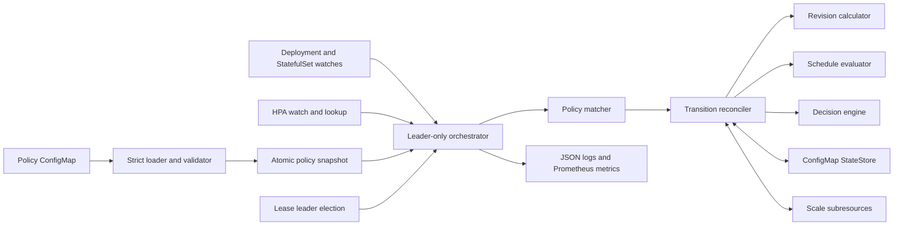
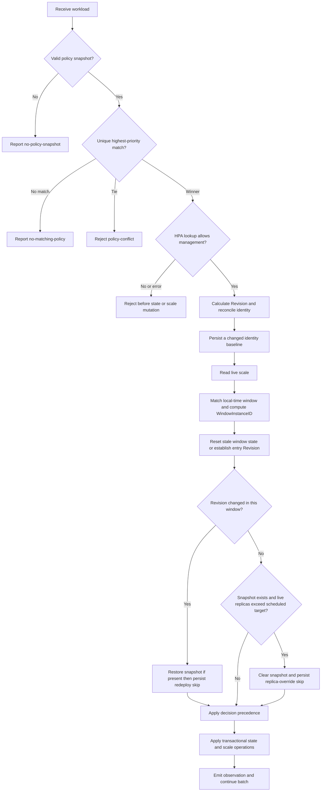
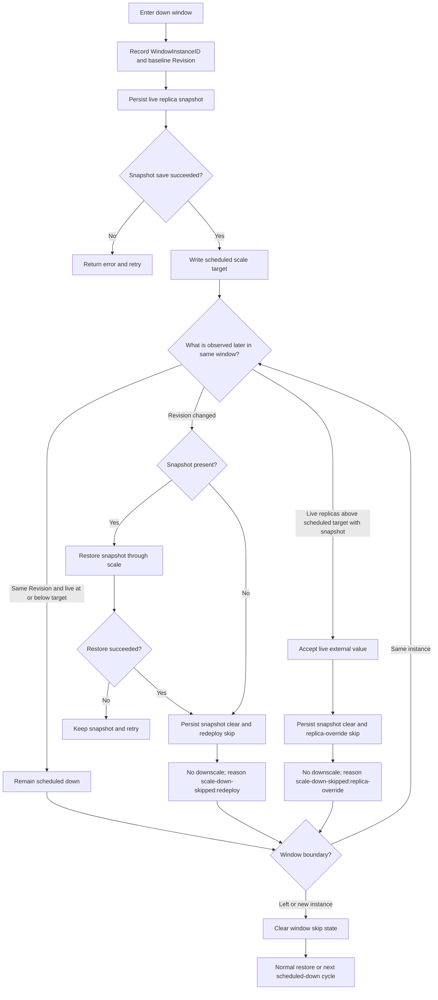

# Design guide

## Overview

Kubernetes Workload Lifecycle Manager is a leader-elected controller that applies image-Revision age and timezone-aware down-window policies to Kubernetes Deployments and StatefulSets. It reads workload metadata, regular container images, HPAs, policies, durable state, and `scale` subresources; its only workload mutation is writing `deployments/scale` or `statefulsets/scale`.

This guide describes the implemented policy, identity, scheduling, persistence, and replica-transition behavior. The current source is authoritative.

## Safety invariants and non-goals

The controller maintains these invariants:

- A workload is mutated only after one policy wins unambiguously and HPA discovery proves that no `autoscaling/v2` HPA targets it.
- The pre-downscale replica value is durably saved before a scale write. Restoration succeeds before the saved snapshot is cleared.
- A down decision uses `min(configured target, snapshot or live baseline)`, so entering a down state never scales up.
- Missing, malformed, unsupported, or capacity-exceeding state is not replaced with guessed state. In particular, a lost replica snapshot is never inferred.
- A policy tie, HPA conflict, HPA lookup failure, state failure, or required API write failure stops that workload transition without weakening the ordering rules.
- The controller never edits Pod templates and never deletes Workloads, Pods, PVCs, or application-owned objects.

Non-goals include autoscaling, rollout orchestration, image mutation, replacing an HPA, restoring replicas without a durable snapshot, and resolving competing external replica writers. The single ConfigMap state backend is intentionally replaceable through `StateStore`; it is not a general-purpose workflow database.

## Correctness Properties

- Policy selection is deterministic: exactly one highest-priority match is required before mutation.
- Revision identity is canonical and independent of container input order.
- Every downscale is preceded by durable snapshot persistence, and every snapshot clear is preceded by successful restoration.
- Current-window skip state is scoped to one `WindowInstanceID`; expiration always overrides it.
- Active workloads without snapshots are never assigned a guessed replica count.

## Architecture



Workload, HPA, and policy events trigger reconciliation; a 30-second full inventory reconciliation closes watch gaps. Every replica serves health and metrics, but only the Lease holder runs the mutation-capable orchestrator. Readiness additionally requires an initial valid policy snapshot and successfully loaded state dependencies.
## Policy loading and matching

Policies are strictly decoded as a complete versioned PolicySet. Unknown fields, explicit nulls, invalid values, invalid IANA zones, empty matching conditions, and invalid regular expressions reject the entire update. A successful load atomically replaces the immutable in-memory snapshot; a failed hot reload leaves the last valid snapshot active. Startup without a valid snapshot is not ready.

A target matches as:

```text
kind AND (Kubernetes label selector OR any namePattern)
```

At least one of `selector` or `namePatterns` must be non-empty. `namePatterns` are compiled at load time with Go's RE2 syntax and automatically wrapped as `^(?:pattern)$`, giving full-name rather than substring matching. An empty workload name cannot match a name pattern. From all matching policies, the unique highest numeric priority wins. Multiple matches tied at the highest priority produce `policy-conflict`; reconciliation stops before state or scale mutation.

## Revision identity

A Revision is the canonical, container-name-sorted set of regular container `{name,image}` pairs selected by `lifecycle.revision`. Omitting `containers` selects every regular container; a non-empty list selects exactly those names, and a missing named container rejects that workload transition. Init and ephemeral containers are excluded.

The controller separately hashes the versioned tracking definition and the canonical selected image set as `trackingSpecHash` and `revisionHash`. Workload UID, tracking-spec hash, or revision hash changes establish a new `firstSeenAt` baseline. Replica count, resource version, labels, policy timing, and non-image Pod-template fields do not. For the same UID, a Revision change preserves an existing replica snapshot and current-window bookkeeping; a new UID discards them.

## Reconciliation flow



Execution order is significant:

1. The orchestrator obtains the current atomic policy snapshot, matches kind/name/labels, and rejects a highest-priority tie.
2. The transition reconciler performs the fail-closed HPA check before loading or mutating state.
3. It calculates Revision identity, loads state, reconciles UID/tracking/Revision identity, and durably saves a changed baseline.
4. It reads the live scale, evaluates the schedule, computes the current window instance, and resets stale window skip fields.
5. It establishes `WindowEntryRevision` for the current window, then handles a current-window redeploy or external replica override.
6. It calls the pure decision engine and applies the required snapshot, scale, restore, clear, or no-op transition.
7. It emits a bounded observation. A failure affects only that workload; later workloads still reconcile.

### Decision precedence

The implemented precedence is exactly:

| Order | Condition | Decision reason | Effect |
|---|---|---|---|
| 1 | `now >= firstSeenAt + maxAge` | `revision-lifecycle-expired` | Down decision to the expired target; overrides both skip modes. |
| 2 | In the current window and `ScaleDownSkipped` | Persisted skip reason | No scale write; legacy empty reason falls back to `scale-down-skipped:redeploy`. |
| 3 | A down window matches | `scale-down-window:<window-name>` | Scheduled down decision. |
| 4 | Outside a down window with a snapshot | `restore-previous-replicas` | Restore snapshot, then clear it. |
| 5 | Otherwise | `active-window` | Preserve live replicas with no scale write. |

In short: **expired > current-window skip > scheduled down > snapshot restore > active/no-op**.

## Timezones, windows, and window identity

Each policy schedule uses an IANA timezone. Persisted timestamps are UTC; schedule evaluation converts the injected current time to local wall time. Time ranges are half-open `[start,end)`: the start minute is included and the end minute is excluded. For cross-midnight ranges, `startDays` names the day on which the window starts. `allDay` covers each listed local day. Daylight-saving behavior follows the IANA zone.

If multiple windows overlap, the lexicographically first matching window name is used. `WindowInstanceID` is `<window-name>:<YYYY-MM-DD>`, where the date is the local start date of that instance. The early-morning side of a cross-midnight window therefore uses the previous date; both sides share one ID. Leaving all windows or observing a different ID clears `WindowEntryRevision`, `WindowInstanceID`, `ScaleDownSkipped`, and `ScaleDownSkipReason`, allowing the next window instance to evaluate normally.
## Replica transaction and current-window lifecycles

Before the first downscale, the reconciler re-reads live `scale.spec.replicas`, saves a `ReplicaSnapshot`, and only then writes scale. A snapshot save failure prevents downscale. While a snapshot exists, later down decisions reuse it instead of recapturing. For restoration, the reconciler performs an idempotent scale write first—even if live replicas already equal the snapshot—and clears the snapshot only after that succeeds. Failed scale or state writes leave a retryable durable ordering point.



### Redeploy during the current window

`WindowEntryRevision` is the baseline Revision for the window instance. A same-UID Revision change preserves that baseline and any snapshot, making the change detectable after the new identity baseline is saved. If a snapshot exists, the controller restores it through the scale subresource first; only after successful restoration does it persist snapshot removal together with `ScaleDownSkipped=true` and `ScaleDownSkipReason="scale-down-skipped:redeploy"`. Without a snapshot it directly persists the skip. The skip survives restart, blocks further scheduled downscales in that window, and resets at the window boundary. Expiration still wins.

### External replica override during the current window

After a prior scheduled downscale has created a snapshot, observing live replicas **above the configured scheduled target** is treated as an intentional external override. The controller accepts the live value, clears the snapshot, persists `ScaleDownSkipped=true` with `ScaleDownSkipReason="scale-down-skipped:replica-override"`, and performs no scale write. That value is not later restored from the old snapshot or forced down during the same window. The decision survives restart and resets when the workload leaves the window or enters a different instance. Expiration still wins.

This behavior deliberately implements **external override wins** semantics. A snapshot may have been saved and the following scheduled scale write may have failed. If a later reconcile still sees live replicas above the target, it cannot distinguish that failed write from a subsequent human or automation override; it accepts the live value, clears the snapshot, and records `scale-down-skipped:replica-override`. This favors external replica intent over repeatedly enforcing the scheduled target.

## Persisted state and compatibility

State is stored in ConfigMap key `states.json` as strict `formatVersion: 1` JSON. Each workload entry contains:

- Identity and audit fields: `kind`, `namespace`, `name`, `workloadUID`, `lastPolicyName`, `trackingSpecHash`, `revisionHash`, and canonical `revision`.
- UTC lifecycle fields: `firstSeenAt` and `lastSeenAt`.
- Optional transactional state: `replicaSnapshot` with `replicas`, `capturedAt`, and `capturedReason`.
- Optional current-window state: `windowEntryRevision`, `windowInstanceID`, `scaleDownSkipped`, and `scaleDownSkipReason`.

The current-window fields use `omitempty`, so valid format-1 documents written before those fields existed decode with zero values and need no migration. A legacy entry with `scaleDownSkipped=true` but an empty `scaleDownSkipReason` remains skipped and reports `scale-down-skipped:redeploy`. Missing optional fields are compatible; unknown fields, invalid identities/hashes/timestamps, malformed JSON, null `states`, and unsupported format versions are rejected rather than treated as empty state.

The ConfigMap store uses resource-version updates with bounded conflict retry, warns near 80% of the Kubernetes 1 MiB data limit, and rejects over-limit writes. Active snapshots are safety-critical state.

## HPA, leadership, observability, and failure behavior

Any matching `autoscaling/v2` HPA rejects management before state or scale access. A cluster-wide HPA lookup error also rejects management. Operators must choose one replica owner.

Lease leader election ensures only one replica reconciles; followers continue to serve `/healthz` and `/metrics` but are not ready. `/readyz` requires leadership, a valid policy snapshot, and loaded dependencies. Workload, HPA, and policy watches restart after disconnects, while periodic full reconciliation provides eventual retry. SIGTERM/SIGINT cancels reconciliation and releases leadership through bounded graceful shutdown.

Structured logs preserve decision reasons, including:

- `revision-lifecycle-expired`
- `scale-down-skipped:redeploy`
- `scale-down-skipped:replica-override`
- `scale-down-window:<window-name>`
- `restore-previous-replicas`
- `active-window`

Orchestration also reports `no-policy-snapshot`, `no-matching-policy`, `policy-conflict`, and `transition-error`. Metrics intentionally use bounded labels: named window reasons collapse to `scale-down-window`; the two current skip reasons are currently counted as `other` by `decisions_total`, while JSON logs retain their exact strings.

Failure handling preserves transaction boundaries. Snapshot persistence failure prevents scale; downscale failure leaves the snapshot; restore failure leaves the snapshot; snapshot-clear persistence failure causes a later idempotent restore-and-clear retry. Policy reload rejection retains the last valid policy. State conflicts receive bounded retries, and a single workload error does not terminate the reconciliation batch.
## Implementation and operational references

- Controller sequencing: [`internal/controller/orchestrator.go`](../internal/controller/orchestrator.go) and [`internal/controller/transition.go`](../internal/controller/transition.go)
- Decision precedence and reasons: [`internal/lifecycle/decision.go`](../internal/lifecycle/decision.go)
- Revision calculation: [`internal/lifecycle/revision.go`](../internal/lifecycle/revision.go)
- Policy validation and matching: [`internal/policy/validate.go`](../internal/policy/validate.go) and [`internal/policy/matcher.go`](../internal/policy/matcher.go)
- Window matching and identity: [`internal/schedule/window.go`](../internal/schedule/window.go) and [`internal/schedule/instance.go`](../internal/schedule/instance.go)
- State schema and storage: [`internal/state/types.go`](../internal/state/types.go), [`internal/state/document.go`](../internal/state/document.go), and [`internal/state/configmap.go`](../internal/state/configmap.go)
- HPA admission: [`internal/workload/hpa.go`](../internal/workload/hpa.go)
- Example policy: [`config/base/policy-configmap.yaml`](../config/base/policy-configmap.yaml)
- Acceptance evidence: [testing traceability](testing-traceability.md)
- Operational diagnosis and safe recovery: [troubleshooting](troubleshooting.md)
- Build, deploy, configuration, and security details: [README](../README.md)
